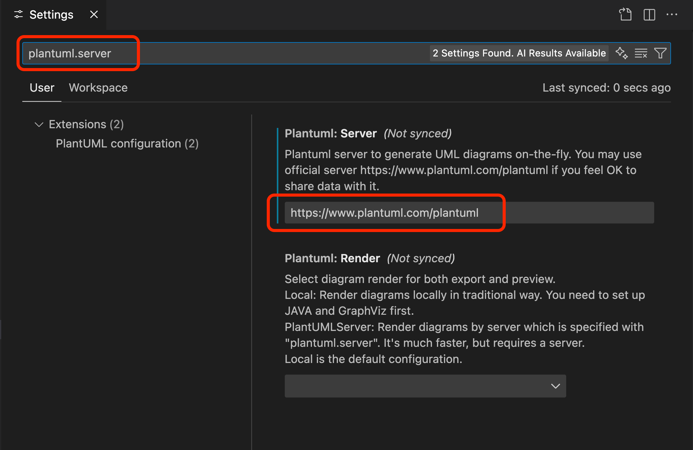

# UML

The history of UML goes back to the 1990ies where the three `Amigos` Grady Booch, James Rumbaugh and Ivar Jacobson. Read more here:

[OOSE](https://www.oose.de/uml-unified-modeling-language?classId=48fe47dc-c7c6-4e13-ace1-ee23106ecb61)

UML was standardized by the Object Mamagenent Group:

[OMG](https://www.omg.org/uml/)

Here you can finde a cheat sheet for UML Notation:

[Notation Overview](https://www.oose.de/wp-content/uploads/2012/05/UML-Notationsübersicht-2.5.pdf)

Here you can finde the syntax for PlantUML:

[PlantUML](https://plantuml.com)

# Installation for VSCode

- Install [PlantUML](https://marketplace.visualstudio.com/items?itemName=jebbs.plantuml)
- Install [GitHub Markdown Preview](https://marketplace.visualstudio.com/items?itemName=bierner.github-markdown-preview)
- Install [VSCode PDF](https://marketplace.visualstudio.com/items?itemName=tomoki1207.pdf)

# Configuration

- Cmd/Ctrl-Shift-P

- 
