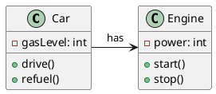

# Overview

A car has a motor ... put general description as text here

Find the syntax for diagrams on [PlantUML](https://plantuml.com)

```plantuml
@startuml
class Car {
    - gasLevel: int 


    + drive()
    + refuel()
}

class Engine {
    - power: int

    + start()
    + stop()
}

Car -> Engine: has

@enduml
```
