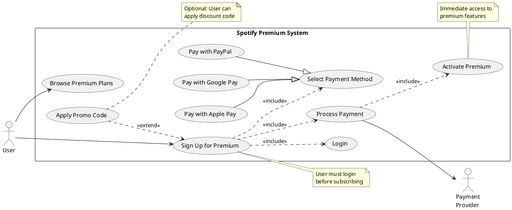
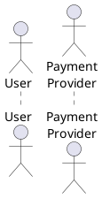
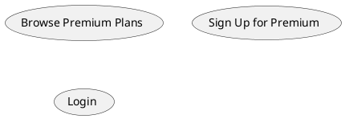
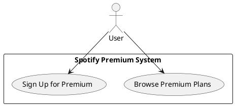
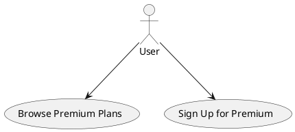
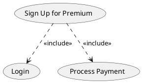
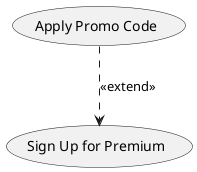
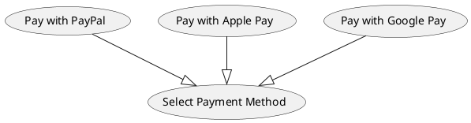
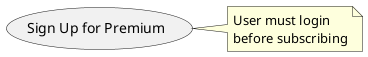

# Spotify Premium Membership - Use Case Diagram

This diagram shows the use cases for becoming a Spotify Premium member.

## PlantUML Diagram

## Actors

- **User** - Person signing up for Spotify Premium
- **Payment Provider** - External payment system (PayPal, Apple Pay, Google Pay)

## Use Cases Description

### Primary Use Cases

- **Browse Premium Plans** - User views available subscription plans
- **Sign Up for Premium** - User subscribes to a premium plan

### Included Use Cases

- **Login** - User authentication (required for sign-up)
- **Select Payment Method** - Choose payment option (PayPal, Apple Pay, Google Pay)
- **Process Payment** - Handle recurring payment subscription
- **Activate Premium** - Enable premium features on user's account

### Extended Use Cases

- **Apply Promo Code** - User optionally applies a discount or promotional code (extends Sign Up)

### Specialized Use Cases

- **Pay with PayPal** - PayPal payment method (specialization of Select Payment Method)
- **Pay with Apple Pay** - Apple Pay payment method (specialization of Select Payment Method)
- **Pay with Google Pay** - Google Pay payment method (specialization of Select Payment Method)

## Flow

1. User browses available premium plans
2. User initiates premium sign-up
3. System requires login authentication
4. User selects payment method
5. (Optional) User applies promo code for discount
6. Payment provider processes subscription payment
7. System activates premium features immediately

## UML Artifacts Explained

### 1. Actors

Actors are external entities that interact with the system. They are represented as stick figures in UML.

- **Primary Actor** (User): The main user who initiates interactions with the system
- **Secondary Actor** (Payment Provider): External system or service that the system interacts with

**Notation**: Stick figure icon with name below

**Purpose**: Represent external entities that interact with the system

### 2. Use Cases

Use cases represent specific functionality or services the system provides. They are shown as ovals/ellipses.

**Notation**: Oval shape with use case name inside

**Purpose**: Represent specific functionality or services the system provides

**Types in this diagram**:

- **Primary Use Cases**: Direct user goals (Browse Plans, Sign Up)
- **Included Use Cases**: Required sub-functions (Login, Payment)
- **Extended Use Cases**: Optional additions (Apply Promo Code)

### 3. System Boundary

The rectangle labeled "Spotify Premium System" represents the boundary of the system being modeled.

**Notation**: Rectangle containing use cases with system name as label

**Purpose**: Define what is inside vs outside the system

- All use cases are within the boundary
- Actors are outside the boundary

### 4. Relationships

#### Association (solid line `-->`)

Shows which actors interact with which use cases.

**Notation**: Solid line with arrow from actor to use case

**Purpose**: Indicate that an actor can initiate or participate in a use case

**Examples**:

- User --> Browse Premium Plans
- User --> Sign Up for Premium

#### Include Relationship (dashed line `..>` with `<<include>>`)

Indicates that a use case **always** includes the behavior of another use case.

**Notation**: Dashed line with arrow from base use case to included use case, labeled with `<<include>>`

**Purpose**: Show required, mandatory sub-functionality

**When to use**: For required, mandatory sub-functionality

**Examples in diagram**:

- Sign Up `<<include>>` Login (you must login to sign up)
- Sign Up `<<include>>` Select Payment Method (required step)
- Sign Up `<<include>>` Process Payment (cannot sign up without payment)

#### Extend Relationship (dashed line `..>` with `<<extend>>`)

Indicates that a use case **optionally** adds behavior to another use case.

**Notation**: Dashed line with arrow from extension use case to base use case, labeled with `<<extend>>`

**Purpose**: Show optional functionality that may or may not occur

**When to use**: For optional functionality that may or may not occur

**Example in diagram**:

- Apply Promo Code `<<extend>>` Sign Up (optional feature)

**Key Difference**:

- **Include** = Required ("base use case needs this")
- **Extend** = Optional ("this can enhance the base use case")

#### Generalization/Specialization (solid line with hollow arrow `--|>`)

Indicates that a use case is a specialized version of a more general use case.

**Notation**: Solid line with hollow arrow from child use case to parent use case

**Purpose**: Show specific variants of a general use case

**When to use**: When you have specific variants of a general use case

**Examples in diagram**:

- Pay with PayPal `--|>` Select Payment Method (PayPal is a specific type of payment method)
- Pay with Apple Pay `--|>` Select Payment Method (Apple Pay is another specific type of payment method)
- Pay with Google Pay `--|>` Select Payment Method (Google Pay is another specific type of payment method)

**Meaning**:

- Child use case (Pay with PayPal) inherits the behavior of parent use case (Select Payment Method)
- Child can add specific behavior for its payment type
- Substitutability: Any specific payment method can be used wherever "Select Payment Method" is needed

### 5. Notes

Rectangular boxes with folded corner containing explanatory text.

**Notation**: Rectangle with folded corner, connected by dashed line

**Purpose**: Provide additional context, constraints, or business rules

**Examples**:

- "User must login before subscribing"
- "Optional: User can apply discount code"

## Relationships Summary Table

| Relationship | Notation | Direction | Meaning | Example |
|-------------|----------|-----------|---------|---------|
| Association | `-->` | Actor → Use Case | Actor interacts with use case | User → Browse Plans |
| Include | `..> <<include>>` | Base → Included | Base always needs included | Sign Up → Login |
| Extend | `..> <<extend>>` | Extension → Base | Extension optionally adds to base | Promo Code → Sign Up |
| Generalization | `--&#124;>` | Child → Parent | Child is specialized version of parent | PayPal → Select Payment |
