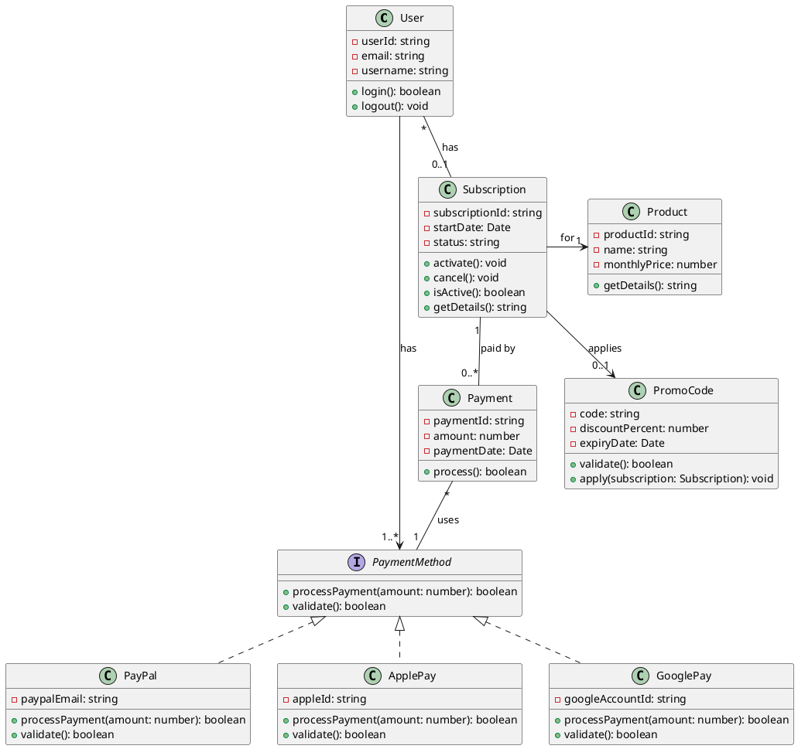
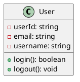
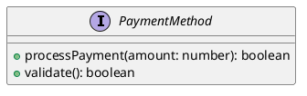
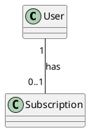
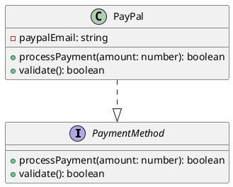
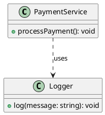
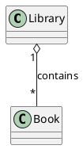
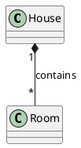

# Spotify Premium Subscription - Class Diagram

This diagram shows the class structure for the Spotify Premium subscription system.

## Class Relationships

### Interfaces

- **Subscribable**: Defines subscription behavior
  - Implemented by `Subscription`
  - Methods: `activate()`, `cancel()`, `isActive()`, `getDetails()`

- **PaymentMethod**: Defines payment processing behavior
  - Implemented by `PayPal`, `ApplePay`, `GooglePay`
  - Methods: `processPayment()`, `validate()`

### Interface Realizations

- **Subscription** implements **Subscribable**: Provides subscription management
- **PayPal** implements **PaymentMethod**: Provides PayPal payment processing
- **ApplePay** implements **PaymentMethod**: Provides Apple Pay payment processing
- **GooglePay** implements **PaymentMethod**: Provides Google Pay payment processing

### Associations (using Interfaces)

- **User to Subscription** (1 to 0..1): A user may have zero or one subscription
- **Subscription to Product** (* to 1): A subscription is for exactly one product
- **User to PaymentMethod** (1 to 1..*): A user must have at least one payment method (via PaymentMethod interface)
- **Subscription to Payment** (1 to 0..*): A subscription can have multiple payments
- **Payment to PaymentMethod** (* to 1): Each payment uses one payment method (via PaymentMethod interface)
- **Subscription to PromoCode** (0..1 to 0..1): A subscription may optionally apply a promo code for discounts

## Key Design Patterns

### Interface-Based Design

**PaymentMethod Interface:**

- Defines contract for all payment processors
- Enables polymorphic payment processing
- User and Payment reference PaymentMethod instead of concrete payment method classes
- Implemented by PayPal, ApplePay, and GooglePay
- Promotes loose coupling and Dependency Inversion Principle
- Easy to add new payment methods (e.g., CreditCard, Bitcoin) by implementing the interface

**Subscribable Interface:**

- Defines contract for subscription-like objects
- Implemented by Subscription class
- User references Subscribable interface, not concrete Subscription class
- Provides common subscription behavior (activate, cancel, isActive, getDetails)
- Makes it easy to add different types of subscriptions in the future

### Benefits of Using Interfaces in Associations

1. **Loose Coupling**: Classes depend on abstractions (interfaces), not concrete implementations
2. **Flexibility**: Easy to add new implementations without changing existing code
3. **Testability**: Can mock interfaces for testing
4. **Extensibility**: New payment methods or subscription types can be added by implementing the interface

## Key Features

- **User Authentication**: User class with login/logout methods
- **Subscription Management**: Activate, cancel subscriptions
- **Payment Processing**: Flexible payment system using PaymentMethod interface
- **Multiple Payment Methods**: Support for PayPal, Apple Pay, and Google Pay
- **Payment Tracking**: Track all payments for subscriptions
- **Promo Code Support**: Optional discount codes can be applied to subscriptions
- **Interface-driven design**: Promotes SOLID principles and loose coupling

## UML Artifacts Explained

### 1. Classes

Classes represent blueprints for objects in the system. They define attributes (data) and operations (behavior).

**Notation**: Rectangle divided into three compartments:

- **Top**: Class name (e.g., `User`, `Subscription`)
- **Middle**: Attributes with visibility and type (e.g., `-userId: string`)
- **Bottom**: Operations/methods with visibility and return type (e.g., `+login(): boolean`)

**Visibility Modifiers**:

- `-` (private): Only accessible within the class
- `+` (public): Accessible from anywhere
- `#` (protected): Accessible within class and subclasses
- `~` (package): Accessible within the same package

### 2. Interfaces

Interfaces define contracts that classes must implement. They specify what operations must be provided without implementation details.

**Notation**: Rectangle with `<<interface>>` stereotype or shorthand lollipop notation

**Purpose**: Enable polymorphism and loose coupling by defining contracts without implementation

**Example**: `PaymentMethod` interface defines `processPayment()` and `validate()` methods

### 3. Relationships

#### Association (solid line `--` or `-->`)

Shows that two classes are connected and can interact with each other. A typical **has-a** relationship implemented with instance variables.

**Notation**:

- Undirected association `--`: Both classes have instance variables pointing to each other
- Directed association `-->`: Only the source class has an instance variable pointing to the destination class

**Purpose**: Represent relationships where one class uses or contains another

**Examples**:

- User `--` Subscription: User **has** a subscription
- Subscription `--` Payment: Subscription **has** payments

**Multiplicity**: Numbers/ranges showing how many instances can be connected

- `1`: Exactly one
- `0..1`: Zero or one (optional)
- `*` or `0..*`: Zero or more
- `1..*`: One or more
- `n..m`: Between n and m

#### Realization/Implementation (dashed line with hollow arrow `..|>`)

Shows that a class implements an interface.

**Notation**: Dashed line with hollow arrow from implementing class to interface

**Purpose**: Indicate that a class provides implementations for all interface methods

**Examples**:

- PayPal `..|>` PaymentMethod
- ApplePay `..|>` PaymentMethod
- GooglePay `..|>` PaymentMethod

#### Dependency (dashed line `..>`)

Shows that one class uses another class (weaker relationship than association), e.g., when a method of a class uses another class within the method body as a local variable but not as instance variable.

**Notation**: Dashed line with arrow from dependent class to dependency

**Purpose**: Indicate temporary usage, method parameters, or local variables

**When to use**: Temporary usage, method parameters, local variables

#### Aggregation (line with hollow diamond `o--`)

"Has-a" relationship where the part can exist independently of the whole.

**Notation**: Line with hollow diamond on the "whole" side

**Purpose**: Show shared ownership where parts can exist independently

**When to use**: When parts can exist without the whole

**Example**: Library `o--` Book (books can exist without the library)

#### Composition (line with filled diamond `*--`)

Strong "contains" relationship where the part cannot exist without the whole.

**Notation**: Line with filled diamond on the "whole" side

**Purpose**: Show strong ownership where parts cannot exist independently

**When to use**: When parts cannot exist without the whole

**Example**: House `*--` Room (room cannot exist without the house)

### 4. Attributes

Properties or data fields that objects of the class will have.

**Notation**: `visibility name: type`

**Purpose**: Define the data that objects of the class will store

**Examples**:

- `-userId: string` (private user ID)
- `-email: string` (private email)
- `-monthlyPrice: number` (private price)

### 5. Operations/Methods

Functions or behaviors that objects of the class can perform.

**Notation**: `visibility name(parameters): returnType`

**Purpose**: Define the behavior that objects of the class can perform

**Examples**:

- `+login(): boolean` (returns true/false)
- `+processPayment(amount: number): boolean`
- `+apply(subscription: Subscription): void`

### 6. Interface Implementation Pattern

This diagram demonstrates the **Dependency Inversion Principle** (SOLID):

- High-level modules (User, Payment) depend on abstractions (PaymentMethod interface)
- Low-level modules (PayPal, ApplePay, GooglePay) implement the abstraction
- Both depend on the interface, not each other

**Benefits**:

- Easy to add new payment methods without changing User or Payment classes
- Classes are loosely coupled through the interface
- Testable (can mock the interface)

## Class Diagram Best Practices

1. **Show Only Relevant Details**: Include only attributes and methods relevant for the context
2. **Use Interfaces**: Program to interfaces, not implementations
3. **Indicate Multiplicities**: Always show cardinality of relationships
4. **Group Related Classes**: Use packages or positioning to group related elements
5. **Use Consistent Naming**: Follow clear, descriptive naming conventions
