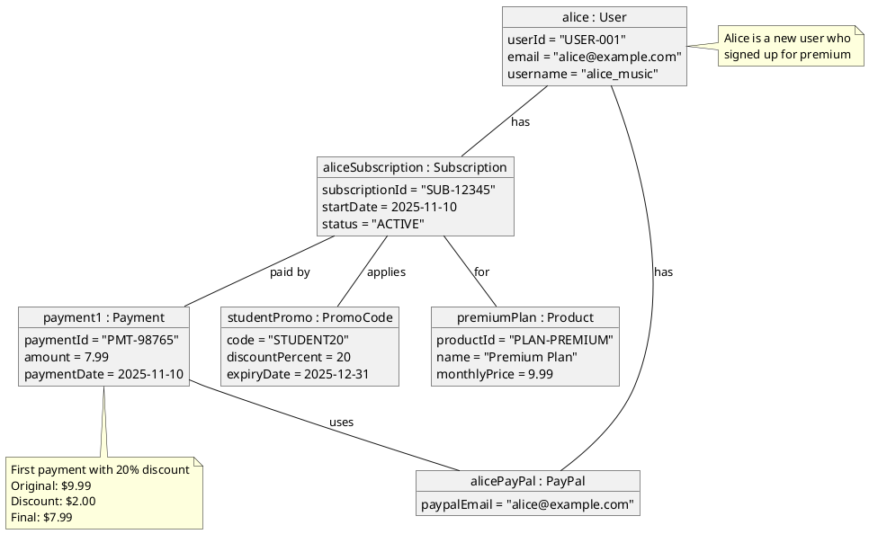
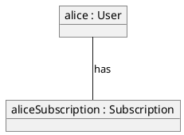
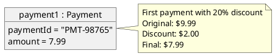

# Spotify Premium Subscription - Object Diagram

This diagram shows concrete instances (objects) of the classes from the class diagram.

## Scenario

Alice signs up for a Spotify Premium plan, adds a PayPal payment method, applies a promo code, and makes her first payment.

## Object Details

### User: alice

- **Instance of**: User class
- **Real values**: Specific user ID, email, username
- **Has**: One subscription and one payment method

### Subscription: aliceSubscription

- **Instance of**: Subscription class
- **Status**: ACTIVE
- **Linked to**: Premium Plan product
- **Discount**: 20% student promo code applied

### Product: premiumPlan

- **Instance of**: Product class
- **Price**: $9.99/month
- **Type**: Standard Premium Plan

### Payment Method: alicePayPal

- **Instance of**: PayPal class (implements PaymentMethod interface)
- **Email**: <alice@example.com>
- **Shows polymorphism**: PayPal is one implementation of PaymentMethod interface

### Payment: payment1

- **Instance of**: Payment class
- **Amount**: $7.99 (after 20% discount)
- **Date**: November 10, 2025
- **Links**: Connected to subscription and PayPal payment method

### Promo Code: studentPromo

- **Instance of**: PromoCode class
- **Discount**: 20% off
- **Code**: "STUDENT20"
- **Valid until**: December 31, 2025

## Key Differences: Class vs Object Diagram

| Aspect | Class Diagram | Object Diagram |
|--------|--------------|----------------|
| **Focus** | Structure and relationships | Specific instances at a point in time |
| **Names** | Class names (User, Payment) | Object names with types (alice : User) |
| **Attributes** | Attribute types (userId: string) | Actual values (userId = "USER-001") |
| **Methods** | Method signatures shown | Methods not shown (runtime behavior) |
| **Purpose** | Design and architecture | Illustrate real scenarios and test cases |
| **Time** | Timeless structure | Snapshot at specific moment |

## What This Diagram Shows

1. **Concrete Instance**: Alice is a real user with specific data
2. **Object Relationships**: How objects are connected at runtime
3. **Interface Implementation**: alicePayPal is a PayPal instance, implementing the PaymentMethod interface
4. **Business Logic**: The discount calculation (20% off = $7.99 from $9.99)
5. **State**: All objects show their current state (ACTIVE status)
6. **Association Navigation**: Shows how to navigate from User to Subscription to Product and Payment

## Use Case Mapping

This object diagram represents the execution of these use cases:

1. ✅ User browses plans → selected Premium Plan
2. ✅ User signs up for premium → created subscription
3. ✅ User logs in → alice user exists
4. ✅ User selects payment method → added PayPal
5. ✅ User applies promo code → STUDENT20 applied
6. ✅ Payment processed → payment1 completed
7. ✅ Premium activated → subscription status = ACTIVE

## Testing Value

Object diagrams are useful for:

- **Test case design**: Define expected object states for testing
- **Documentation**: Show how system works with real data
- **Communication**: Help stakeholders understand concrete scenarios
- **Debugging**: Visualize object relationships during runtime
- **Validation**: Verify that class design supports required scenarios

## UML Artifacts Explained

### 1. Objects

Objects are instances of classes with specific attribute values at a specific point in time.

**Notation**: Rectangle with underlined name showing `objectName : ClassName`

**Purpose**: Represent concrete instances of classes at runtime

**Examples**:

- `alice : User` (alice is an instance of User class)
- `aliceSubscription : Subscription`
- `premiumPlan : Product`

**Key Difference from Classes**: Objects show actual data, classes show structure

### 2. Object Attributes

Attributes show actual values, not types.

**Notation**: `attributeName = value`

**Purpose**: Show the specific runtime values of object properties

**Examples**:

- `userId = "USER-001"` (actual value, not type)
- `email = "alice@example.com"`
- `monthlyPrice = 9.99`

**Contrast with Class Diagram**:

- Class: `userId: string` (shows type)
- Object: `userId = "USER-001"` (shows value)

### 3. Object Relationships (Links)

Links are instances of associations between objects.

**Notation**: Solid line connecting objects, often labeled with relationship name

**Purpose**: Show actual runtime connections between specific objects

**Examples**:

- `alice -- sub : has` (alice has a subscription)
- `sub -- plan : for` (subscription is for a plan)
- `payment -- paypal : uses` (payment uses PayPal)

### 4. Instance Specification

Objects represent a snapshot of the system at a specific moment in time.

**Notation**: Complete object diagram showing all instances and their values at a specific point

**Purpose**: Show system state at a particular point in time and demonstrate that class design supports use cases

**Example**: This diagram shows the state after Alice completed signup on November 10, 2025

### 5. Interface Realization in Objects

Objects can be instances of classes that implement interfaces.

**Notation**: Object name includes the concrete class (e.g., `alicePayPal : PayPal`)

**Purpose**: Demonstrate polymorphism in action at runtime

**Example**: `alicePayPal : PayPal`

- PayPal class implements PaymentMethod interface
- alicePayPal object can be used anywhere PaymentMethod is expected
- Shows polymorphism in action

### 6. Notes and Annotations

Notes provide additional context about objects or their states.

**Notation**: Rectangle with folded corner, connected by dashed line

**Purpose**: Explain business logic, calculations, or special conditions

**Examples**:

- "First payment with 20% discount"
- "Alice is a new user who signed up for premium"

## Object Diagram vs Class Diagram

| Aspect | Class Diagram | Object Diagram |
|--------|---------------|----------------|
| **Abstraction Level** | Abstract blueprint | Concrete instance |
| **Names** | Class names | Object names with class types |
| **Attributes** | Types defined | Actual values shown |
| **Methods** | Signatures shown | Not shown (runtime only) |
| **Time** | Static structure | Snapshot at specific time |
| **Purpose** | Design | Illustrate scenarios |
| **Multiplicity** | Constraints shown | Actual counts visible |

## When to Use Object Diagrams

1. **Testing**: Define expected object states for test cases
2. **Documentation**: Show concrete examples of system behavior
3. **Communication**: Help non-technical stakeholders understand the system
4. **Validation**: Verify class design supports required scenarios
5. **Debugging**: Visualize actual object relationships during runtime
6. **Teaching**: Demonstrate object-oriented concepts with real examples

## Best Practices

1. **Use Real Data**: Show actual values, not placeholders
2. **Document State**: Include timestamp or context about when snapshot was taken
3. **Show Relationships**: Include all relevant links between objects
4. **Add Notes**: Explain business logic or calculations
5. **Validate Against Classes**: Ensure object structure matches class diagram
6. **Keep Focused**: Show one scenario per diagram
