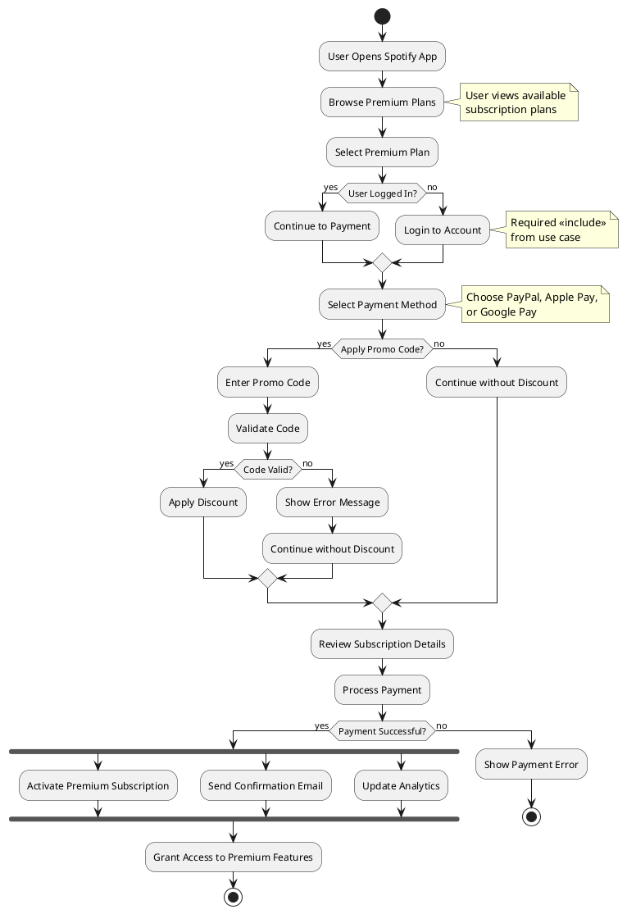
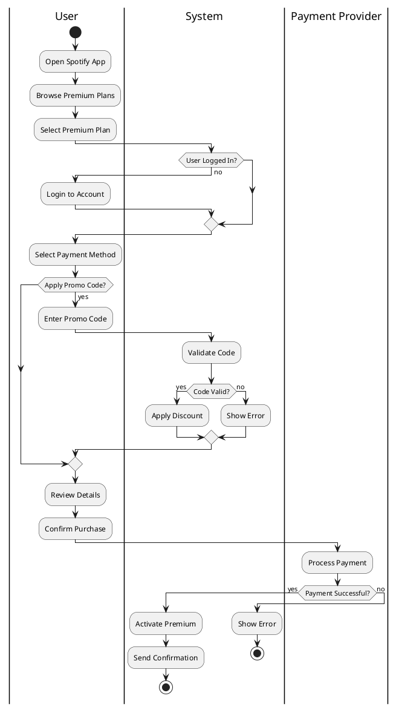
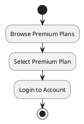
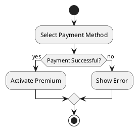
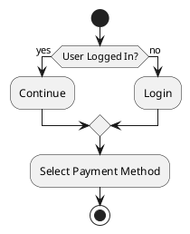
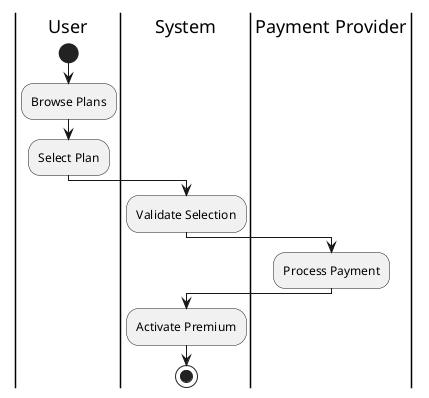
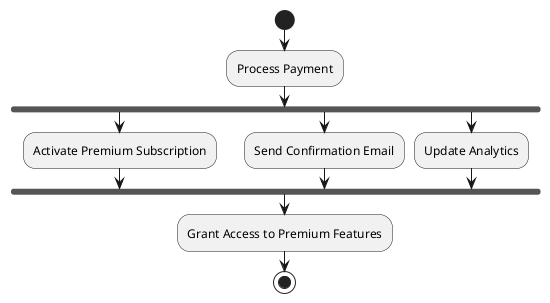

# Spotify Premium Sign-Up - Activity Diagram

This diagram shows the workflow for signing up for a Spotify Premium subscription.



## Activity Diagram Components

### Start and End Nodes

- **Start** (●): User opens Spotify app
- **Stop** (◉): Successful activation or user cancels

### Activities (Rectangles)

- **Browse Premium Plans** - User views available subscription options
- **Select Premium Plan** - User chooses a subscription plan
- **Login to Account** - Authentication step (required)
- **Select Payment Method** - Choose PayPal, Apple Pay, or Google Pay
- **Enter Promo Code** - Optional discount code entry
- **Process Payment** - Payment processing
- **Activate Premium Subscription** - Enable premium features

### Decision Nodes (Diamonds)

- **User Logged In?** - Check if authentication required
- **Apply Promo Code?** - Optional path (matches `<<extend>>` in use case)
- **Code Valid?** - Validate promo code
- **Payment Successful?** - Check payment result
- **Retry Payment?** - Allow user to try again on failure

### Flow

- **Solid arrows** show the sequence of activities
- **Labeled branches** show conditions (yes/no)
- **Merge points** where alternative paths rejoin

## Mapping to Use Case Diagram

| Use Case | Activity Diagram Elements |
|----------|--------------------------|
| Browse Premium Plans | "Browse Premium Plans" activity |
| Sign Up for Premium | Overall flow from start to activation |
| Login | "Login to Account" activity (decision: User Logged In?) |
| Select Payment Method | "Select Payment Method" activity |
| Process Payment | "Process Payment" activity + success/failure decision |
| Activate Premium | "Activate Premium Subscription" activity |
| Apply Promo Code | Optional branch "Apply Promo Code?" (`<<extend>>`) |

## Decision Points Explained

### 1. User Logged In?

- **Yes**: Skip login, proceed to payment
- **No**: Must login first (`<<include>>` relationship from use case)

### 2. Apply Promo Code?

- **Yes**: Enter and validate code (`<<extend>>` relationship from use case)
- **No**: Continue with full price
- This is optional behavior, matching the extend relationship

### 3. Code Valid?

- **Yes**: Apply discount to subscription
- **No**: Show error but continue without discount

### 4. Payment Successful?

- **Yes**: Activate subscription and complete
- **No**: Show error and offer retry

### 5. Retry Payment?

- **Yes**: Return to payment method selection
- **No**: End process (user cancels)

## Swimlanes Alternative

For a more detailed view showing responsibilities, we could use swimlanes:



## Key Features of This Activity Diagram

1. **Sequential Flow**: Clear start-to-end process
2. **Decision Points**: Shows branching logic (login check, promo code, payment result)
3. **Optional Behavior**: Promo code is optional (matches `<<extend>>`)
4. **Required Behavior**: Login is required if not logged in (matches `<<include>>`)
5. **Error Handling**: Payment failure with retry option
6. **Parallel Activities**: Could be extended with fork/join for concurrent operations
7. **Business Logic**: Discount calculation, validation, activation

## Business Rules Illustrated

- User must be logged in before proceeding to payment
- Promo code is optional but must be validated if provided
- Invalid promo codes don't block the process
- Payment must succeed for activation
- Users can retry failed payments
- Confirmation is sent after successful activation

## Notes

- This diagram focuses on the **happy path** with error handling
- For complex scenarios, consider adding swimlanes to show actor responsibilities
- Fork/Join nodes could be added for parallel activities (e.g., sending email while activating)
- Exception handling paths could be expanded for production systems

## UML Artifacts Explained

### 1. Initial Node (Start)

The starting point of an activity.

**Notation**: Filled black circle (●)

**Purpose**: Indicates where the workflow begins

**Example**: User opens Spotify app

### 2. Activity Final Node (Stop)

The ending point of an activity.

**Notation**: Filled black circle inside a hollow circle (◉)

**Purpose**: Indicates successful completion or termination

**Example**: Premium activated or user cancels

### 3. Activities (Actions)

Individual steps or tasks in the workflow.

**Notation**: Rounded rectangle with action name inside

**Examples**:

- `Browse Premium Plans`
- `Login to Account`
- `Process Payment`



**Purpose**: Represents a unit of work to be performed

### 4. Decision Nodes

Points where the flow branches based on conditions.

**Notation**: Diamond shape (◇)

**Outgoing flows**: Labeled with conditions (yes/no, true/false)

**Examples**:

- `User Logged In?` → branches to "yes" or "no"
- `Payment Successful?` → branches based on result
- `Apply Promo Code?` → optional behavior branch



**Purpose**: Shows conditional logic and alternative paths

### 5. Merge Nodes

Points where alternative flows come back together.

**Notation**: Diamond shape (◇) with multiple incoming edges and one outgoing edge

**Purpose**: Rejoin paths after branching



**Example**: After login decision, flows merge to continue to payment selection

### 6. Control Flow

Arrows showing the sequence of activities.

**Notation**: Solid arrow (→) connecting activities

**Purpose**: Show the order of execution

**Examples**:

- Simple flow: `Browse Plans` → `Select Plan`
- Conditional: `User Logged In?` → `[yes]` → `Continue to Payment`

**Labels**: Can be labeled with conditions on decision branches

### 7. Notes

Additional information or explanations attached to activities.

**Notation**: Rectangle with folded corner, connected by dashed line

**Purpose**: Provide context, business rules, or clarifications

**Examples**:

- "Required `<<include>>` from use case"
- "Choose PayPal, Apple Pay, or Google Pay"

### 8. Swimlanes (Optional)

Vertical or horizontal partitions showing different actors or systems.

**Notation**: Columns or rows with labels (User, System, Payment Provider)

**Purpose**: Show responsibility for each activity, clarify which actor performs which action, and illustrate handoffs between actors



**Example**: User swimlane for user actions, System swimlane for automated tasks

### 9. Fork and Join Nodes

**Fork**: Splits flow into parallel paths (synchronization bar)

**Join**: Merges parallel paths back together (synchronization bar)

**Notation**: Thick horizontal or vertical bar

**Purpose**: Model concurrent or parallel activities that can execute simultaneously

**In this diagram**: After successful payment, the workflow forks into three parallel activities:

```plantuml
fork
  :Activate Premium Subscription;
fork again
  :Send Confirmation Email;
fork again
  :Update Analytics;
end fork
```

**How it works**:

1. **Fork point** (`fork`): Splits the workflow into multiple concurrent paths
2. **Parallel execution**: All three activities execute simultaneously:
   - Activate Premium Subscription (updates database)
   - Send Confirmation Email (notifies user)
   - Update Analytics (records metrics)
3. **Join point** (`end fork`): Waits for ALL parallel activities to complete before continuing
4. **After join**: Flow continues to `:Grant Access to Premium Features;`



**Purpose**: Model concurrent or parallel activities that can execute simultaneously

**Why use it here**: These three post-payment tasks are independent and can happen at the same time for better efficiency

### 10. Guard Conditions

Boolean expressions on control flows that determine which path to take.

**Notation**: `[condition]` in square brackets

**Purpose**: Clearly specify decision criteria

**Examples**:

- `[yes]` - condition is true
- `[no]` - condition is false
- `[Payment Successful]` - explicit condition

## Activity Diagram vs Other Diagrams

| Aspect | Activity Diagram | Use Case Diagram | Sequence Diagram | State Diagram |
|--------|------------------|------------------|------------------|---------------|
| **Focus** | Workflow/process | System functionality | Message exchange | Object states |
| **Time** | Sequential steps | Not time-based | Time-ordered messages | State changes |
| **Actors** | Can show (swimlanes) | Primary focus | Participants | Not shown |
| **Control Flow** | Detailed branching | Not shown | Sequential only | Event-driven |
| **Purpose** | Process modeling | Requirements | Interactions | Lifecycle |

## When to Use Activity Diagrams

1. **Business Process Modeling**: Document workflows and processes
2. **Algorithm Design**: Show logic flow with decisions and loops
3. **Use Case Realization**: Detail how a use case is executed step-by-step
4. **Parallel Processing**: Model concurrent activities with fork/join
5. **Error Handling**: Show exception paths and recovery
6. **System Workflows**: Document how different parts of system interact

## Best Practices

1. **Focus on One Process**: One activity diagram per use case or process
2. **Use Swimlanes**: Include swimlanes when multiple actors are involved
3. **Label Decisions Clearly**: Use meaningful condition labels
4. **Show Error Paths**: Include exception and failure handling
5. **Limit Complexity**: Break complex processes into sub-activities
6. **Maintain Consistent Granularity**: Keep activities at similar level of detail
