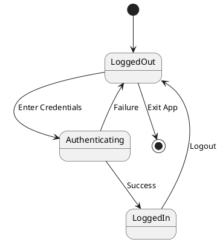
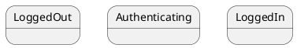
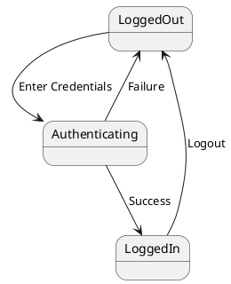
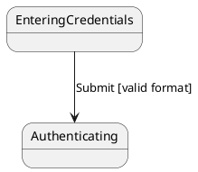
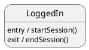
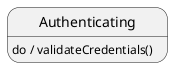

# Spotify Premium System - State Diagram

This diagram shows the states and transitions during the user login process.

## Understanding State Diagrams

A **state diagram** (also called a state machine diagram) models the different
states of an object and the transitions between those states based on events.

### Key Elements

1. **Initial State** (`[*]`): Starting point (black filled circle)
2. **States** (rectangles): Conditions or situations during an object's
   lifecycle
3. **Transitions** (arrows): Changes from one state to another triggered by
   events
4. **Final State** (optional): Ending point (circle with filled center)

### States in Login Process

- **LoggedOut**: User is not authenticated
- **EnteringCredentials**: User is typing username/password
- **Authenticating**: System is verifying credentials
- **AuthenticationFailed**: Login attempt was unsuccessful
- **LoggedIn**: User is successfully authenticated

### Transitions and Events

- `User Opens App` → Enters LoggedOut state
- `Click Login` → Moves to EnteringCredentials
- `Submit Credentials` → Triggers authentication
- `Valid Credentials` → Success, enter LoggedIn
- `Invalid Credentials` → Failure, enter AuthenticationFailed
- `Retry Login` → Return to credential entry
- `Cancel` or `Logout` → Return to LoggedOut

### Mapping to Other Diagrams

- **Activity Diagram**: Shows the flow of the login process (step-by-step
  actions)
- **State Diagram**: Shows the states of the user's session (logged in/out
  conditions)
- **Use Case Diagram**: The "Login" use case is included in the "Sign Up for
  Premium" use case
- **Sequence Diagram**: Would show the detailed message exchanges during
  authentication

## UML Artifacts Explained

### 1. Initial State (Start)

The beginning state when an object is created or a process starts.

**Notation**: Filled black circle (●)

**Purpose**: Marks the entry point to the state machine

**Example**: User session starts in initial state before transitioning to
LoggedOut

### 2. States

Conditions or situations an object can be in during its lifecycle.

**Notation**: Rectangle with rounded corners containing the state name

**Examples**:

- `LoggedOut` - user is not authenticated
- `Authenticating` - system is verifying credentials
- `LoggedIn` - user is authenticated

**Purpose**: Represents a condition where the object waits for events or
performs activities

### 3. Transitions

Changes from one state to another, triggered by events.

**Notation**: Arrow from source state to target state, labeled with
event/trigger

**Syntax**: `event [guard] / action`

- **event**: What triggers the transition
- **[guard]**: Optional condition that must be true
- **/action**: Optional action performed during transition

**Examples**:

- `Enter Credentials` - trigger from LoggedOut to Authenticating
- `Success` - trigger from Authenticating to LoggedIn
- `Failure` - trigger from Authenticating to LoggedOut
- `Logout` - trigger from LoggedIn to LoggedOut

**Purpose**: Shows how and when the object changes states

### 4. Final State (Optional)

The terminal state where the process ends.

**Notation**: Filled black circle inside a hollow circle (◉)

**Purpose**: Indicates the object's lifecycle has completed

**Example**: Could be used if user account is deleted (not shown in this
diagram)

### 5. Events

Occurrences that trigger state transitions.

**Types**:

- **Signal Events**: Asynchronous messages or signals
- **Call Events**: Method/function calls
- **Time Events**: Triggered after a time period
- **Change Events**: Triggered when a condition becomes true

**Examples in this diagram**:

- `Enter Credentials` - user action
- `Success` - result of authentication check
- `Failure` - result of failed authentication
- `Logout` - user action

### 6. Guard Conditions (Not shown, but important)

Boolean expressions that must be true for a transition to occur.

**Notation**: `[condition]` in square brackets

**Purpose**: Add conditional logic to transitions

**Example**: `Submit [valid format]` - only transition if credentials are valid
format

**Purpose**: Add conditional logic to transitions

### 7. Entry/Exit Actions (Not shown, but important)

Actions performed when entering or exiting a state.

**Notation**:

- `entry / action` - performed when entering state
- `exit / action` - performed when exiting state

**Purpose**: Define behavior associated with states

**Example**:

**Purpose**: Define behavior associated with states

### 8. Internal Activities (Not shown, but important)

Actions that occur within a state without causing a transition.

**Notation**: `event / action` inside state box

**Purpose**: Show ongoing activities within a state

**Example**:

**Purpose**: Show ongoing activities within a state

## State Diagram vs Activity Diagram

| Aspect          | State Diagram          | Activity Diagram                |
| --------------- | ---------------------- | ------------------------------- |
| **Focus**       | States of an object    | Flow of activities              |
| **Trigger**     | Events                 | Completion of activities        |
| **Purpose**     | Object lifecycle       | Process workflow                |
| **Waiting**     | Object waits in states | Activities execute continuously |
| **Transitions** | Event-driven           | Flow-driven                     |
| **Example**     | Login states           | Login process steps             |

## State Diagram vs Sequence Diagram

| Aspect          | State Diagram     | Sequence Diagram   |
| --------------- | ----------------- | ------------------ |
| **Focus**       | States over time  | Messages over time |
| **Perspective** | Single object     | Multiple objects   |
| **Shows**       | State transitions | Interactions       |
| **Purpose**     | Lifecycle         | Collaboration      |

## When to Use State Diagrams

1. **Object Lifecycle**: Model how an object changes over time
2. **User Sessions**: Track login/logout and session states
3. **Order Processing**: Model order states (pending, shipped, delivered,
   cancelled)
4. **Connection Management**: Track connection states (connected, disconnected,
   reconnecting)
5. **UI Components**: Model states of buttons, forms, dialogs
6. **Protocol Implementation**: Model communication protocol states
7. **Game States**: Model game flow (menu, playing, paused, game over)

## Best Practices

1. **Use Descriptive State Names**: Choose clear, unambiguous state names
2. **Minimize States**: Include only states that matter for the model
3. **Label All Transitions**: Clearly label transitions with events
4. **Ensure Complete Transitions**: Ensure all states have exit paths
5. **Add Guards When Needed**: Use conditions when transitions depend on
   criteria
6. **Document Events**: Clearly define what triggers each transition
7. **Consider Substates**: Use nested states for complex state machines
