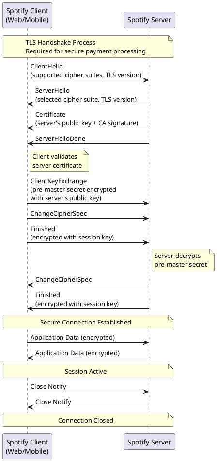
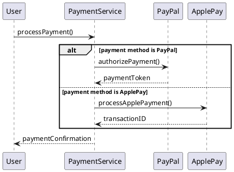
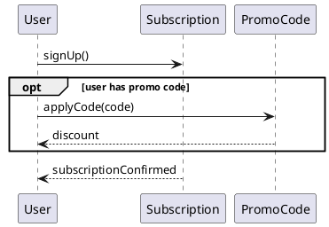
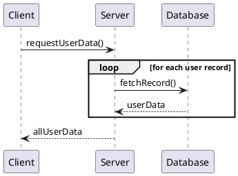
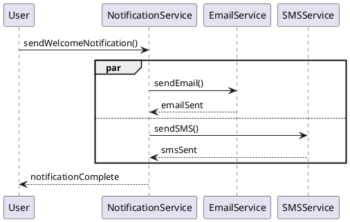

# Spotify Premium System - Sequence Diagram

This diagram shows the TLS/SSL authentication handshake that occurs when a user interacts with the Spotify Premium system.

## Spotify Premium Context

This sequence diagram shows the **TLS authentication handshake** that occurs when a user interacts with the Spotify Premium system. Before any sensitive operations (login, payment processing, subscription management) can occur, the client and server must establish a secure, encrypted connection.

## Key Steps Explained

1. **ClientHello**: Spotify client (web/mobile app) initiates connection and sends supported encryption methods
2. **ServerHello**: Spotify server responds with chosen encryption method
3. **Certificate Exchange**: Spotify server sends its certificate for authentication (proves server identity)
4. **Key Exchange**: Client generates and sends encrypted session key to server
5. **ChangeCipherSpec**: Both parties switch to encrypted communication mode
6. **Finished Messages**: Verify handshake completed successfully
7. **Secure Communication**: All application data (login credentials, payment info, subscription data) is now encrypted
8. **Connection Closure**: Clean termination of the secure session

## Mapping to Spotify Premium Use Cases

This TLS authentication process occurs **before** any of the following use cases:

- **Login**: User credentials are transmitted over the encrypted TLS connection
- **Sign Up for Premium**: Personal information and account creation occur securely
- **Select Payment Method**: Payment method details are protected by TLS encryption
- **Process Payment**: Payment transactions use the secure TLS channel
- **Apply Promo Code**: Even promo codes are transmitted securely

## Why TLS is Critical for Spotify Premium

1. **Payment Security**: Protects credit card and PayPal information during transmission
2. **Credential Protection**: Encrypts username/password during login
3. **Data Privacy**: Ensures user data (email, subscription details) cannot be intercepted
4. **Trust**: Server certificate proves the client is connecting to the real Spotify server, not an imposter
5. **Compliance**: Meets PCI-DSS requirements for handling payment card data

## Sequence Diagram Elements

### Participants

- **Spotify Client (Web/Mobile)**: The frontend application (from Component Diagram)
- **Spotify Server**: The backend API Gateway and services (from Component Diagram)

### Messages (Arrows)

- **Synchronous Messages** (→): Request-response communication
- Messages show the TLS handshake protocol steps in sequence

### Notes

- Provide additional context about validation and decryption steps
- Indicate different phases of the connection lifecycle

## UML Artifacts Explained

### 1. Participants (Actors/Objects)

Entities that interact in the sequence.

**Notation**: Rectangle at the top of the diagram with participant name

**Examples**:

- `Spotify Client (Web/Mobile)` - the frontend application
- `Spotify Server` - the backend system

**Purpose**: Represents the entities exchanging messages

**Types**:

- **Actor**: External user or system (stick figure alternative)
- **Object**: System component or class instance
- **Boundary**: Interface between system and external world
- **Control**: Coordinates activities
- **Entity**: Persistent data or business object

### 2. Lifeline

Vertical dashed line representing the participant's existence over time.

**Notation**: Dashed vertical line extending down from participant box

**Purpose**: Shows the participant exists during this time period

**Time Axis**: Time flows from top to bottom

### 3. Messages

Communications between participants.

**Notation**: Arrows between lifelines

**Types**:

**Synchronous Message** (→):

- Solid line with filled arrowhead
- Sender waits for response
- Example: `ClientHello`, `ServerHello`

**Asynchronous Message** (→):

- Solid line with open arrowhead
- Sender doesn't wait for response
- Used for notifications, events

**Return Message** (⤶):

- Dashed line with open arrowhead
- Response to synchronous message
- Often implicit and not shown

**Self-Message** (⮌):

- Message from participant to itself
- Shows internal processing

**Message Syntax**: `messageName(parameters): returnValue`

### 4. Activation Bars (Execution Specification)

Rectangular boxes on lifelines showing when a participant is active/processing.

**Notation**: Thin vertical rectangle on the lifeline

**Purpose**: Shows the period during which a participant is performing an action

**Example**: While server is processing `ServerHello`, it has an activation bar

### 5. Notes

Additional explanations attached to parts of the diagram.

**Notation**: Rectangle with folded corner, connected by dashed line

**Purpose**: Provide context, explain steps, document business rules

**Examples**:

- "TLS Handshake Process - Required for secure payment processing"
- "Client validates server certificate"
- "Secure Connection Established"

### 6. Combined Fragments

Boxes that group messages to show control logic (conditionals, loops, parallel execution).

**Notation**: Rectangle with operator label in pentagon at top-left corner

**Purpose**: Model complex interaction logic like branching, iteration, and concurrency

**Types**:

#### alt (alternative) - If-Then-Else Logic

Shows mutually exclusive paths based on conditions.

**Notation**: Rectangle with `alt` operator label, divided into sections with guards

**Purpose**: Model conditional logic with mutually exclusive paths

**When to use**: When different conditions lead to different message sequences

**When to use**: When different conditions lead to different message sequences

#### opt (optional) - Conditional Execution

Message(s) only occur if the condition is true. No else branch.

**Notation**: Rectangle with `opt` operator label and guard condition

**Purpose**: Model optional behavior that may or may not occur

**When to use**: For optional behavior that may or may not happen

**When to use**: For optional behavior that may or may not happen

#### loop - Repeated Messages

Shows messages that repeat multiple times.

**Notation**: Rectangle with `loop` operator label and iteration condition

**Purpose**: Model repeated operations (iterations, retries, batch processing)

**When to use**: When operations repeat (iterations, retries, batch processing)

**Loop conditions**: Can specify iteration count or condition

- `loop 5 times`
- `loop while hasMoreData`
- `loop for each item in collection`

**When to use**: When operations repeat (iterations, retries, batch processing)

**Loop conditions**: Can specify iteration count or condition

- `loop 5 times`
- `loop while hasMoreData`
- `loop for each item in collection`

#### par (parallel) - Concurrent Execution

Shows messages that occur simultaneously/independently.

**Notation**: Rectangle with `par` operator label, divided into parallel sections

**Purpose**: Model concurrent actions that happen at the same time

**When to use**: When actions happen at the same time or order doesn't matter

**When to use**: When actions happen at the same time or order doesn't matter

**Other Combined Fragments** (less common):

- **break**: Exit from the fragment (like exception handling)
- **critical**: Critical region (no parallel execution allowed)
- **neg**: Negative scenario (invalid/forbidden interaction)
- **ref**: Reference to another diagram

### 7. Time Constraints (Not shown, but important)

Annotations showing timing requirements.

**Notation**: Curly braces with timing constraint

**Purpose**: Specify performance requirements

**Example**: `{t < 5 seconds}` - operation must complete within 5 seconds

### 8. Message Sequence

The order of messages from top to bottom shows the sequence of interactions.

**Notation**: Messages ordered from top to bottom represent chronological order

**Purpose**: Show the exact order of communications

**Reading Order**: Top to bottom = chronological order

**Example in diagram**:

1. ClientHello (first)
2. ServerHello (second)
3. Certificate (third)
... and so on

## Sequence Diagram vs Other Diagrams

| Aspect | Sequence Diagram | Activity Diagram | Use Case Diagram | Class Diagram |
|--------|------------------|------------------|------------------|---------------|
| **Focus** | Message exchange | Workflow | Functionality | Structure |
| **Time** | Chronological | Sequential flow | Not time-based | Static |
| **Participants** | Explicit | Swimlanes (optional) | Actors | Classes |
| **Purpose** | Interaction | Process | Requirements | Design |
| **Detail Level** | Message-level | Activity-level | High-level | Structural |

## When to Use Sequence Diagrams

1. **Protocol Design**: Model communication protocols (like TLS)
2. **API Design**: Show request-response patterns
3. **Use Case Realization**: Detail how use cases are implemented through interactions
4. **Error Scenarios**: Document error handling and recovery
5. **Performance Analysis**: Identify bottlenecks in message flow
6. **Authentication Flows**: Model login, authorization sequences
7. **Integration Design**: Show how systems communicate

## Best Practices

1. **Focus on One Scenario**: One scenario per diagram
2. **Name Messages Clearly**: Use descriptive, unambiguous names
3. **Show Return Messages**: Include return messages when the value matters
4. **Use Combined Fragments**: Model conditional or repeated interactions
5. **Limit Participants**: Too many makes diagram cluttered (5-7 max)
6. **Add Notes**: Explain complex or important interactions
7. **Match Class/Component Names**: Use consistent naming with other diagrams
8. **Time Flows Down**: Always read top to bottom

## Reading This Diagram

1. **Start at top**: Client initiates with ClientHello
2. **Follow arrows**: Each arrow represents a message
3. **Time order**: Earlier messages are higher in diagram
4. **Note boxes**: Provide context for what's happening
5. **Back and forth**: Shows request-response pattern
6. **End at bottom**: Connection closed completes the sequence
