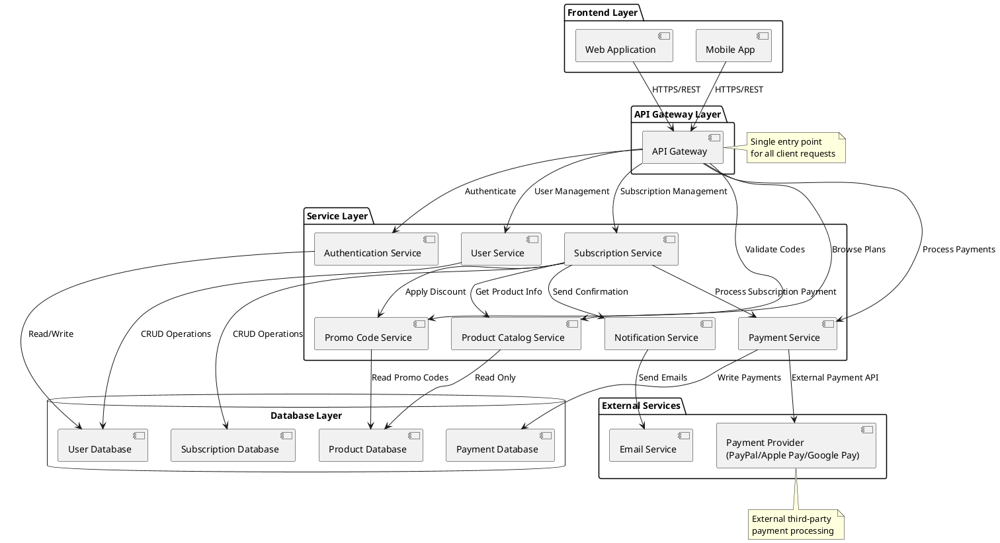
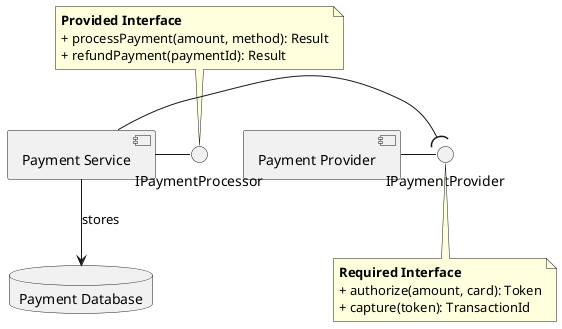
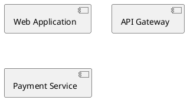
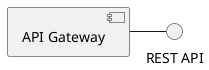
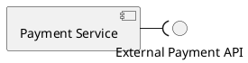
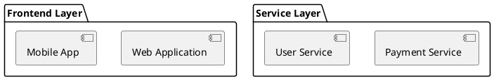
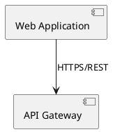
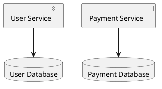
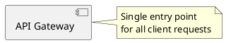

# Spotify Premium System - Component Diagram

This diagram shows the high-level architecture and components of the Spotify Premium subscription system.

## Component Diagrams

### Full System Overview



### Payment Processing Subsystem (Detailed with Interfaces)

This focused diagram shows the payment processing part of the system with explicit interfaces and ports.



## System Layers

This section explains the different layers and components in the Spotify Premium architecture.

## Components Explained

### Frontend Layer

**Web Application**

- Browser-based Spotify client
- React/Angular/Vue application
- Allows users to browse plans and subscribe
- Responsive UI for desktop browsers

**Mobile App**

- Native iOS/Android applications
- Provides same functionality as web
- Optimized for mobile experience

### API Gateway Layer

**API Gateway**

- Single entry point for all client requests
- Routes requests to appropriate services
- Handles authentication/authorization
- Request/response transformation
- Rate limiting and throttling
- Maps to use case interactions

### Service Layer

**Authentication Service**

- User login/logout functionality
- Session management
- Token generation (JWT)
- Maps to: **Login** use case

**User Service**

- User account management
- Profile information
- Account creation and updates
- Maps to: User management in **Sign Up** use case

**Subscription Service**

- Core subscription management
- Activate/cancel subscriptions
- Subscription status tracking
- Links users to products
- Maps to: **Sign Up for Premium**, **Activate Premium** use cases

**Product Catalog Service**

- Manages product offerings and plans
- Product pricing and features
- Read-only for clients
- Maps to: **Browse Premium Plans** use case

**Payment Service**

- Payment processing coordination
- Integrates with payment providers
- Payment history tracking
- Maps to: **Select Payment Method**, **Process Payment** use cases

**Promo Code Service**

- Validates promotional codes
- Applies discounts to subscriptions
- Manages code lifecycle
- Maps to: **Apply Promo Code** use case (<<extend>>)

**Notification Service**

- Sends email confirmations
- Payment receipts
- Subscription updates
- Integrates with email service

### External Services

**Payment Provider (PayPal/Apple Pay/Google Pay)**

- Third-party payment processing
- Multiple payment method support
- Represents external payment methods from class diagram
- Corresponds to PayPal, ApplePay, and GooglePay classes implementing PaymentMethod interface

**Email Service**

- External email delivery (SendGrid, AWS SES)
- Transactional email sending
- Delivery tracking

### Database Layer

**User Database**

- Stores user account information
- Credentials, profiles
- Links to payment methods

**Subscription Database**

- Active and historical subscriptions
- Subscription status and dates
- Links to users and products

**Product Database**

- Product catalog (plans)
- Pricing information
- Promotional codes

**Payment Database**

- Payment transaction records
- Payment history
- Transaction statuses

## Component Relationships

### Interfaces and Ports

**Provided Interfaces** (Lollipop notation `-`)
Components expose these interfaces for others to use:

- **REST API**: Provided by API Gateway, consumed by Frontend apps
- **Auth API**: Provided by Authentication Service
- **User API**: Provided by User Service
- **Subscription API**: Provided by Subscription Service
- **Catalog API**: Provided by Product Catalog Service
- **Payment API**: Provided by Payment Service
- **Promo API**: Provided by Promo Code Service
- **Notification API**: Provided by Notification Service
- **External Payment API**: Provided by Payment Provider (Stripe/PayPal)
- **Email API**: Provided by Email Service
- **Database**: Provided by all database components

**Required Interfaces** (Socket notation `-(`)
Components require these interfaces from others:

- Frontend apps require **REST API** from Gateway
- API Gateway requires service APIs (Auth, User, Subscription, etc.)
- Subscription Service requires Catalog, Payment, Promo, and Notification APIs
- Payment Service requires **External Payment API**
- Notification Service requires **Email API**
- All services require **Database** interface

### Interface Contracts

**REST API Interface**

```
Endpoints:
- GET /api/plans - Browse premium plans
- POST /api/auth/login - User authentication
- POST /api/subscriptions - Create subscription
- POST /api/payments - Process payment
- POST /api/promo/validate - Validate promo code
```

**External Payment API Interface**

```
Methods:
- processPayment(amount): boolean
- validate(): boolean
- refund(transactionId, amount): RefundResult
```

**Database Interface**

```
Methods:
- query(sql): ResultSet
- insert(table, data): id
- update(table, id, data): boolean
- delete(table, id): boolean
```

### Port Types

1. **Provided Ports** (Services offered)
   - Components expose functionality through lollipop symbols
   - Other components can connect to use these services
   - Example: API Gateway provides REST API

2. **Required Ports** (Dependencies)
   - Components need functionality from others
   - Shown as socket symbols
   - Example: Subscription Service requires Payment API

### Dependencies

- **Frontend → API Gateway**: All client requests flow through gateway
- **API Gateway → Services**: Gateway routes to appropriate microservices
- **Services → Services**: Inter-service communication (e.g., Subscription → Payment)
- **Services → Databases**: Each service manages its own data store
- **Services → External**: Integration with third-party services

## Mapping to Use Case Diagram

| Use Case | Primary Component(s) |
|----------|---------------------|
| Browse Premium Plans | Product Catalog Service, Product Database |
| Sign Up for Premium | Subscription Service, User Service |
| Login | Authentication Service, API Gateway |
| Select Payment Method | Payment Service, User Service |
| Process Payment | Payment Service, Payment Provider |
| Activate Premium | Subscription Service |
| Apply Promo Code | Promo Code Service |

## Mapping to Class Diagram

| Class | Component(s) | Database |
|-------|-------------|----------|
| User | User Service | User Database |
| Subscription | Subscription Service | Subscription Database |
| Product | Product Catalog Service | Product Database |
| PaymentMethod (interface) | Payment Service | - |
| PayPal, ApplePay, GooglePay | Payment Service | Payment Provider (External) |
| Payment | Payment Service | Payment Database |
| PromoCode | Promo Code Service | Product Database |

## Architecture Patterns

### Microservices Architecture

- Each service is independently deployable
- Services communicate via APIs
- Loose coupling between components
- Can scale services independently

### API Gateway Pattern

- Single entry point for clients
- Simplifies client code
- Centralized authentication
- Request routing and composition

### Database per Service

- Each service owns its database
- Data isolation and independence
- Services don't directly access other service databases
- Polyglot persistence possible

### External Integration

- Payment processing delegated to specialized providers
- Email delivery through dedicated services
- Reduces system complexity
- Leverages third-party expertise

## Deployment Considerations

- **Frontend**: CDN for static assets, separate deployment
- **API Gateway**: Load balanced, high availability
- **Services**: Containerized (Docker), orchestrated (Kubernetes)
- **Databases**: Managed cloud databases (AWS RDS, etc.)
- **External Services**: SaaS integrations (Stripe, SendGrid)

## Key Benefits

1. **Modularity**: Services can be developed and deployed independently
2. **Scalability**: Scale individual components based on demand
3. **Maintainability**: Clear separation of concerns
4. **Flexibility**: Easy to swap implementations (e.g., different payment provider)
5. **Resilience**: Failure in one service doesn't crash entire system

## UML Artifacts Explained

### 1. Components

Components are modular parts of a system that encapsulate implementation and expose interfaces.

**Notation**: Rectangle with component icon (small rectangle with two tabs on left side) or stereotype `<<component>>`

**Examples**:

- `[Web Application]` - Frontend component
- `[API Gateway]` - Gateway component
- `[Payment Service]` - Service component



**Purpose**: Represents a modular, deployable, and replaceable part of the system

### 2. Interfaces

Define contracts that components provide or require.

**Notation**:

- **Provided Interface** (Lollipop): Component offers this interface to others (`-`)
- **Required Interface** (Socket): Component needs this interface from others (`-(`)

**Purpose**: Show dependencies and contracts between components

**Provided Interface** (Lollipop):

- Component offers this interface to others
- Example: API Gateway provides REST API



**Required Interface** (Socket):

- Component needs this interface from others
- Example: Payment Service requires External Payment API



**Purpose**: Show dependencies and contracts between components

### 3. Packages

Group related components together.

**Notation**: Rectangle with tab in upper-left corner containing package name

**Purpose**: Organize components into logical layers or modules

**Examples**:

- `Frontend Layer` - contains Web Application and Mobile App
- `Service Layer` - contains all microservices
- `External Services` - contains third-party integrations



### 4. Dependencies

Shows that one component depends on another.

**Notation**: Dashed arrow (`-->`) pointing to the dependency

**Purpose**: Show which components communicate and how

**Examples**:

- `WebApp --> Gateway : HTTPS/REST`
- `PaymentService --> PaymentProvider : External Payment API`



**Labels**: Often include protocol or interface name

### 5. Ports

Connection points on components where interfaces are exposed or required.

**Notation**: Small square on component boundary

**Types**:

- **Provided Port**: Where component exposes an interface
- **Required Port**: Where component needs an interface

**Purpose**: Explicitly shows connection points for interfaces

### 6. Database Components

Special components representing data storage.

**Notation**: Cylinder shape or `database` stereotype

**Purpose**: Represent persistent data storage components

**Examples**:

- `[User Database]`
- `[Subscription Database]`
- `[Payment Database]`



### 7. Notes

Additional explanations attached to components or relationships.

**Notation**: Rectangle with folded corner, connected by dashed line

**Purpose**: Provide context, explain architectural decisions, or document constraints

**Examples**:

- "Single entry point for all client requests"
- "External third-party payment processing"



### 8. Subsystems

Can be represented as components or packages containing other components.

**Notation**: Package or component containing other components

**Purpose**: Zoom into specific parts of the architecture

**Example**: Payment Processing Subsystem showing detailed interfaces

## Component Diagram vs Other Diagrams

| Aspect | Component Diagram | Class Diagram | Deployment Diagram | Package Diagram |
|--------|-------------------|---------------|---------------------|-----------------|
| **Focus** | Logical components | Classes/objects | Physical hardware | Code organization |
| **Level** | Architecture | Design | Infrastructure | Code structure |
| **Shows** | Services, modules | Attributes, methods | Servers, nodes | Namespaces, folders |
| **Purpose** | System structure | Detailed design | Deployment topology | Code organization |
| **Interfaces** | Provided/Required | Realized | Not shown | Imports/exports |

## When to Use Component Diagrams

1. **System Architecture**: Show high-level structure of the system
2. **Microservices Design**: Document service boundaries and dependencies
3. **API Design**: Show how components interact through interfaces
4. **Integration Planning**: Identify external dependencies
5. **Deployment Planning**: Understand what needs to be deployed
6. **Team Organization**: Align teams with component boundaries
7. **Technology Decisions**: Map components to technology choices

## Best Practices

1. **Define Clear Boundaries**: Each component should have well-defined responsibilities
2. **Use Interface-Based Design**: Use interfaces to decouple components
3. **Organize into Layers**: Group components into logical layers (presentation, business, data)
4. **Minimize Dependencies**: Reduce coupling between components
5. **Document Protocols**: Label dependencies with communication protocols
6. **Show Key Components**: Focus on important components, not every class
7. **Maintain Consistent Granularity**: Keep components at similar level of abstraction
8. **Map to Use Cases**: Align components with use case requirements
