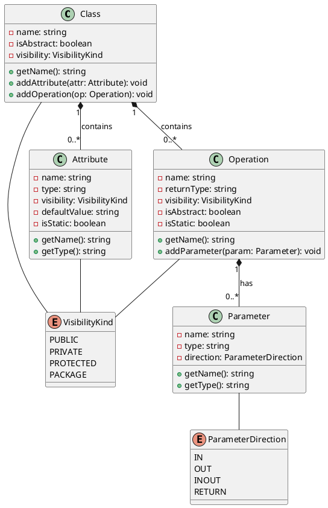

# UML Class Diagram - Simplified Meta Model

This meta model describes the structure of a UML Class element.



## Meta Model Description

### Class

The central element representing a UML class.

**Attributes:**

- `name`: The name of the class
- `isAbstract`: Whether the class is abstract
- `visibility`: The visibility of the class (public, private, etc.)

**Relationships:**

- Contains zero or more **Attributes** (composition)
- Contains zero or more **Operations** (composition)

### Attribute

Represents a property or field of a class.

**Properties:**

- `name`: The attribute name
- `type`: The data type of the attribute
- `visibility`: Access modifier (+, -, #, ~)
- `defaultValue`: Optional default value
- `isStatic`: Whether the attribute is static (class-level)

**Example:** `-email: string` or `+MAX_SIZE: int = 100`

### Operation

Represents a method or function of a class.

**Properties:**

- `name`: The operation name
- `returnType`: The return type of the operation
- `visibility`: Access modifier
- `isAbstract`: Whether the operation is abstract
- `isStatic`: Whether the operation is static

**Relationships:**

- Has zero or more **Parameters**

**Example:** `+login(): boolean` or `-calculateTotal(items: List): number`

### Parameter

Represents a parameter of an operation.

**Properties:**

- `name`: Parameter name
- `type`: Parameter data type
- `direction`: Parameter direction (in, out, inout, return)

**Example:** In `addMember(user: User)`, `user` is a parameter of type `User`

### VisibilityKind (Enumeration)

Defines the access level of class elements.

- `PUBLIC` (+): Accessible from anywhere
- `PRIVATE` (-): Accessible only within the class
- `PROTECTED` (#): Accessible within the class and subclasses
- `PACKAGE` (~): Accessible within the same package

### ParameterDirection (Enumeration)

Defines the direction of parameter flow.

- `IN`: Input parameter (default)
- `OUT`: Output parameter
- `INOUT`: Input/output parameter
- `RETURN`: Return value

## Key Relationships

1. **Composition (◆)**: A Class owns its Attributes and Operations
   - If a Class is deleted, its Attributes and Operations are deleted
   
2. **Composition**: An Operation owns its Parameters
   - If an Operation is deleted, its Parameters are deleted

3. **Association**: Classes, Attributes, Operations reference VisibilityKind
   - Parameters reference ParameterDirection

## Example Mapping

For the class:

```text
class User {
    -userId: string
    +login(): boolean
}
```

**Meta Model Instances:**

- `Class`: name="User", isAbstract=false, visibility=PUBLIC
- `Attribute`: name="userId", type="string", visibility=PRIVATE
- `Operation`: name="login", returnType="boolean", visibility=PUBLIC
