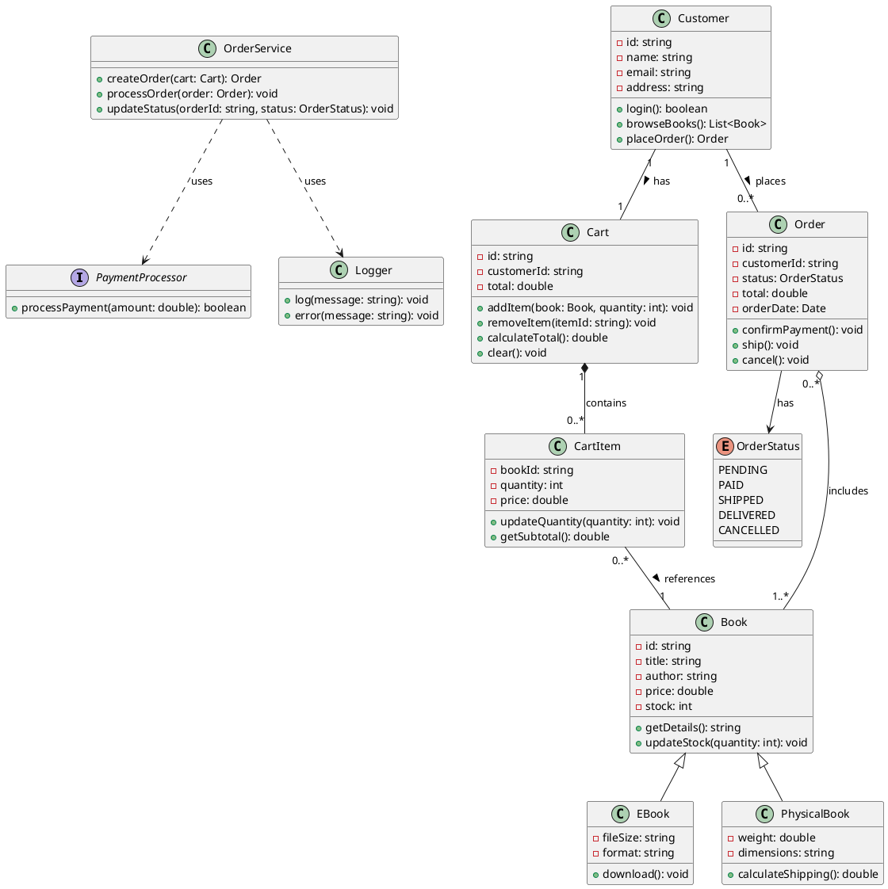

# Class Diagram - Online Bookstore

## PlantUML Diagram

## Diagram Explanation

### Classes (5+ required):
1. **Customer** - Represents a user of the bookstore
2. **Book** - Base class for all books
3. **Cart** - Shopping cart for customers
4. **CartItem** - Individual items in the cart
5. **Order** - Placed orders

### Enum:
- **OrderStatus** - Tracks order lifecycle states

### Interface:
- **PaymentProcessor** - Interface for payment processing

### Key Relationships:

1. **Association** (Customer ↔ Cart): Customer has one Cart
2. **Association** (Customer ↔ Order): Customer places multiple Orders
3. **Composition** (Cart ◆→ CartItem): Cart strongly owns CartItems (items can't exist without cart)
4. **Association** (CartItem → Book): CartItem references a Book
5. **Aggregation** (Order ◇→ Book): Order includes Books (weaker ownership)
6. **Generalization** (Book ← EBook/PhysicalBook): Inheritance relationship
7. **Dependency** (OrderService ⇢ Logger): OrderService temporarily uses Logger
8. **Dependency** (OrderService ⇢ PaymentProcessor): OrderService uses PaymentProcessor interface

### Design Notes:

- **Simple and clear**: Only essential attributes and methods
- **All requirements met**: Includes composition, association, aggregation, dependency, generalization, enum, and interface
- **Realistic**: Models a real bookstore scenario with customers, books, carts, and orders
- **Consistent**: Uses the same entity structure as described in the assignment
