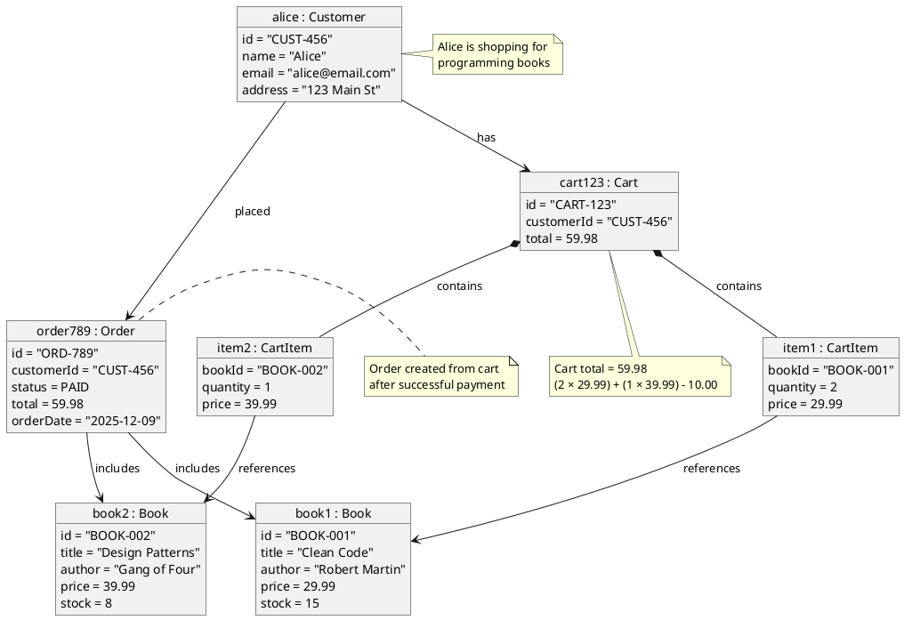

# Object Diagram - Online Bookstore

## PlantUML Diagram

## Diagram Explanation

### Concrete Instances:
- **alice**: A Customer object with actual values
- **cart123**: Alice's shopping cart
- **item1, item2**: Two items in the cart
- **book1, book2**: Two specific books from the catalog
- **order789**: The resulting order after checkout

### Real Scenario:
Alice browses the bookstore, adds "Clean Code" (2 copies) and "Design Patterns" (1 copy) to her cart, then completes the purchase, creating an order with PAID status.

### Key Relationships:
- Alice **has** a Cart
- Cart **contains** CartItems (composition)
- CartItems **reference** Books
- Alice **placed** an Order
- Order **includes** Books

 
 