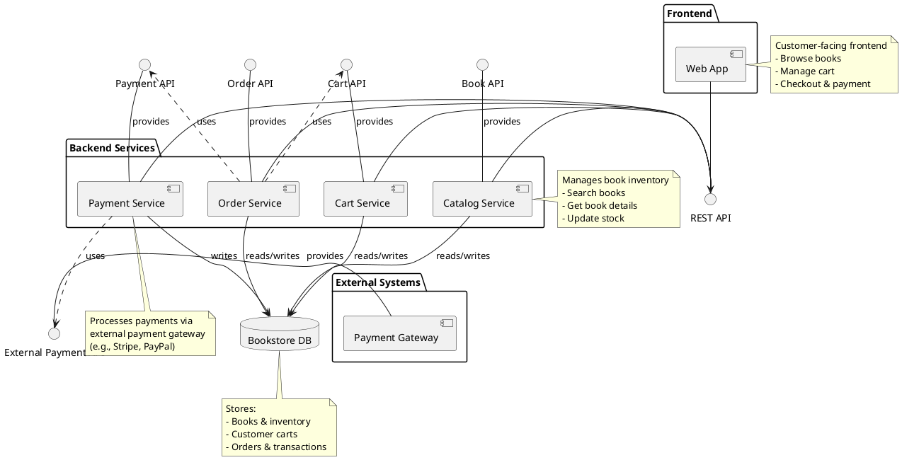

# Component Diagram - Online Bookstore

## PlantUML Diagram

## Diagram Explanation

### Components (4+):
1. **Web App** - Frontend application (Customer UI)
2. **Catalog Service** - Manages books and inventory
3. **Cart Service** - Handles shopping carts
4. **Order Service** - Processes orders
5. **Payment Service** - Handles payments
6. **Payment Gateway** - External payment provider
7. **Bookstore DB** - Data storage

### Interfaces (2+):
1. **REST API** - Main API between frontend and backend
2. **Book API** - Interface provided by Catalog Service
3. **Cart API** - Interface provided by Cart Service
4. **Order API** - Interface provided by Order Service
5. **Payment API** - Interface provided by Payment Service
6. **External Payment API** - Interface for external payment processing

### Key Relationships:
- **Provided Interfaces** (solid line with lollipop): Services offer these interfaces
- **Required Interfaces** (dashed arrow): Components depend on these interfaces
- **Dependencies** (dashed arrows): OrderService uses CartAPI and PaymentAPI
- **External Dependency**: PaymentService uses External Payment API

### Architecture Flow:
1. Web App communicates via REST API
2. Backend services provide specific interfaces
3. OrderService coordinates cart and payment services
4. PaymentService integrates with external payment gateway
5. All services persist data to shared database
